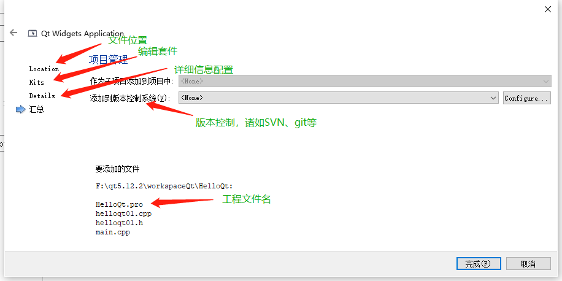
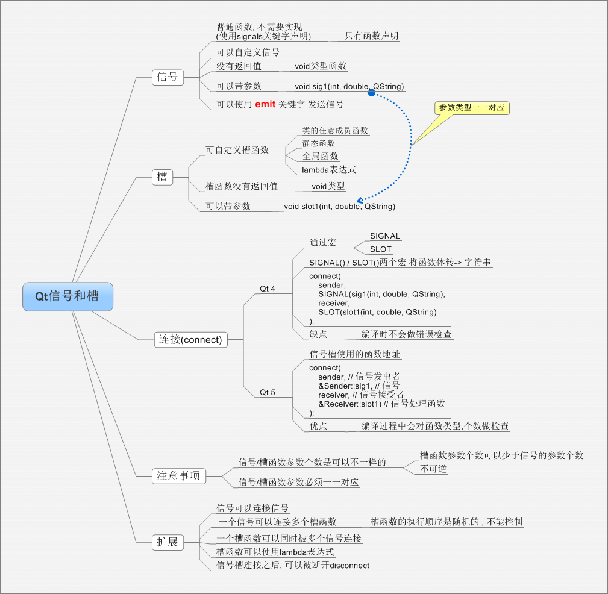
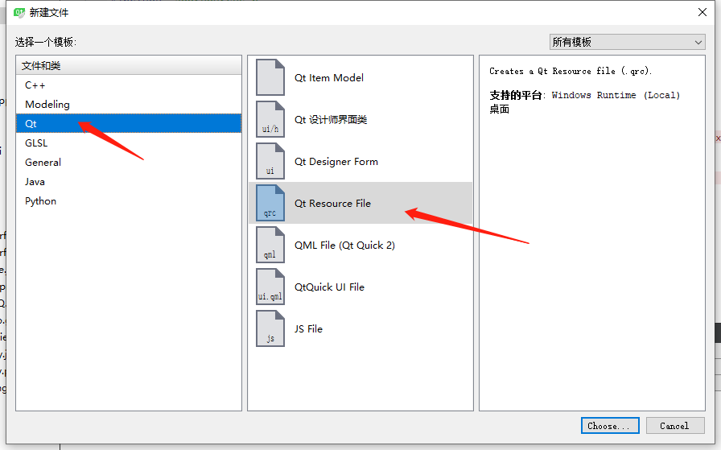

## <center>Qt笔记 -- 0612 </center>

[TOC]


### Qt初识

1. 一个**跨平台**的C++**图形用户界面应用程序框架**，1991年 Qt最早由奇趣科技开发
2. 支持多种平台开发：Windows，Uinux/X11，Macintosh ，Embedded 等
3. Qt按照不同的版本发行，分为商业版和开源版（LGPL）
4. 当前使用版本qt5.12.2，[下载地址](https://mirrors.tuna.tsinghua.edu.cn/qt/archive/qt/5.12/5.12.2/)
   

### Qt学习

1. Qt**接触界面**

2. 

3. **使用向导创建第一个工程**

   1. 说明：

      
   3. 在配置基类时，默认的基类有QMainWindow、QWidget以及QDialog。
   4. 系统会默认给我们添加main.cpp、xxx.cpp、 xxx.h和.pro项目文件，完成后即可创建出一个Qt桌面程序。

4. **main.cpp**

   1. ```c++
      ​```
      简单窗口程序：
      
      #include "helloqt01.h"
      #include <QApplication> //QApplication是Qt的应用程序类的头文件
      
      int main(int argc, char *argv[]) //main是程序入口，argc：命令行变量数量，argv:命令行变量数组
      {
          QApplication a(argc, argv); //a:应用程序对象，有且仅有一个
          HelloQt01 w; //窗口对象，继承自QWidget
          w.show(); //调用show方法，显示窗口
      
          return a.exec(); //消息循环机制
      }
      ​```
      ```


### pro、h、cpp文件

1. ​	**.pro文件格式**

   1. ```c++
      // 使用“+=”，是因为我们添加我们的配置选项到任何一个已经存在中
      
      QT       += core gui  //包含的模块
          
      greaterThan(QT_MAJOR_VERSION, 4): QT += widgets //大于Qt4版本 才包含widget模块
          
      TARGET = HelloQt  //应用程序名  生成的.exe程序名称
          
      TEMPLATE = app    //模板类型    应用程序模板
          
      CONFIG += c++11   //使用c++11的特性
          
      SOURCES += main.cpp\   //源文件
              main.cpp \
              helloqt01.cpp
      HEADERS  += helloqt01.h   //头文件
      
      
      ```

2. **.h文件**

   1. **.h文件定义**

      ~~~c++
      ```
      #ifndef HELLOQT01_H
      #define HELLOQT01_H
      
      #include <QWidget> //包含头文件QWidget的窗口类
      
      class HelloQt01 : public QWidget
      {
          Q_OBJECT //Q_OBJECT宏，允许类中使用信号和槽的机制
      
      public:
          HelloQt01(QWidget *parent = 0); //构造函数
          ~HelloQt01(); //析构函数
      };
      
      #endif // HELLOQT01_H
      ```
      ~~~

3. **.cpp文件**

   1. 认识main.cpp

      ```c++
      #include "widget.h"
      #include <QApplication>
      
      int main(int argc, char *argv[])
      {
          QApplication a(argc, argv);
          Widget w;
          w.show();
      
          return a.exec();
      }
      
      ```

### Qt命名规范

1. **类名**：首字母大写，单词和单词之间大写

2. **函数名**：变量名称首字母小写，单词和单词之间大写
   
   

### 快捷键

1. 注释：**ctrl+/**

2. 运行：**ctrl+r**

3. 编译：**ctrl+b**

4. 字体缩放：**ctrl+鼠标滚轮**

5. 查找：**ctrl+f**

6. 整体移动：**ctrl+shift+上下键**

7. 帮助文档：**F1**

8. 自动对齐：**ctrl+i**

9. 同名.h和.cpp切换：**F4**

10. 剪切当前行，或者删除本行：**shift+Delete**

11. 加行：**ctrl+enter** 向下添加一行；**ctrl+shift+enter** 向上添加一行
    
    

### 按钮及对象树认识

1. **按钮创建**

2. ```c++
   #include "helloqt01.h"
   #include "QPushButton" //按钮控件头文件
   #include "myqtbtn.h"
   #include "QDebug"
   HelloQt01::HelloQt01(QWidget *parent)
       : QWidget(parent) //继承了QWidget父类,构造函数
   {
       QPushButton * btn = new QPushButton;
       btn -> setParent(this); //设置按钮父类
       btn -> setText("btn01"); //按钮内容
       btn -> show(); //显示按钮
   
   ​    QPushButton * btn2 = new QPushButton("btn02",this);
   ​    btn2 -> move(100,30);
   ​    btn2 ->show();
   ​    resize(500,500); //重置窗口大小
   ​    setFixedSize(500,500); //设置固定窗口大小
   ​    setWindowTitle("hello Widget...");
   
   ​    MyQtBtn * myBtn = new MyQtBtn;
   ​    myBtn -> setParent(this);
   ​    myBtn -> setText("自定义btn");
   ​    myBtn -> move(200,60);
   ​    myBtn -> show();
   }
   
   HelloQt01::~HelloQt01()
   {
       qDebug() << "HelloQt析构...";
   }
   ```

   

3. **自定义按钮btn**

   ~~~c++
   ```
   #include "myqtbtn.h"
   #include "QDebug"
   MyQtBtn::MyQtBtn(QWidget *parent) : QPushButton (parent)
   {
       qDebug() << "按钮构造...";
   }
   MyQtBtn::~MyQtBtn(){
       qDebug() << "按钮析构...";
   }
   ```
   ~~~

   ~~~c++
   //按钮头文件
   #ifndef MYQTBTN_H
   #define MYQTBTN_H
   
   #include <QPushButton>
   
   class MyQtBtn : public QPushButton
   {
       Q_OBJECT
   public:
       explicit MyQtBtn(QWidget *parent = nullptr);
       ~MyQtBtn(); //析构
   signals:
   
   public slots:
   };
   
   #endif // MYQTBTN_H
   ```
   ~~~

   
   
4. **对象树认识**

   1. QObject是以对象树的形式组织起来的。

      当你创建一个QObject对象时，会看到QObject的构造函数接收一个QObject指针作为参数，这个参数就是 parent，也就是父对象指针。

      这相当于，**在创建QObject对象时，可以提供一个其父对象，我们创建的这个QObject对象会自动添加到其父对象的children()列表。**

      **当父对象析构的时候，这个列表中的所有对象也会被析构。（注意，这里的父对象并不是继承意义上的父类！）**

   2. QWidget是能够在屏幕上显示的一切组件的父类

      **QWidget继承自QObject，因此也继承了这种对象树关系。一个孩子自动地成为父组件的一个子组件**。

      **我们也可以自己删除子对象，它们会自动从其父对象列表中删除。**

   3. **局部对象的析构顺序应该按照其创建顺序的相反过程**

   4. Qt对象树图示

      

   

5. **Qt坐标**

   1. 左上角为坐标零点

   2. 向右是x增加

   3. 向下是y增加

      

### 信号(signal)和槽(slot)

1.  连接函数connect，将信号和槽连接起来，<u>connect(信号发送者,发送的信号(地址),信号接受者,接受的信号(地址))</u>

2.  ```c++
    //    connect(myBtn,&MyQtBtn::clicked,this,&HelloQt01::close);
        connect(myBtn,&QPushButton::clicked,this,&QWidget::close);
    ```

3.  能够实现**松散耦合**的特性

4.  注意，使用信号槽前，遇到报错：**<u>collect2.exe:-1: error: error: ld returned 1 exit status</u>**

    + 解决：.pro文件中：QT += core gui **<u>network</u>**

5. 自定义信号槽

   1.  使用connect()可以让我们连接系统提供的信号和槽。Qt 的信号槽机制并不仅仅是使用系统提供的那部分，允许我们自己设计自己的信号和槽。

   2.  信号signal（写到signals:下，需要声明，不需要实现函数，可以有参与重载）

       ```c++
       signals:
       //自定义信号，声明一个函数方法
       void hangry();
       void hangry(QString footName);
       ```

   3.  槽slot（写到public 或 public slots下，需要声明与实现，可以有参与重载）

       ~~~c++
       public:
           explicit Student(QObject *parent = nullptr);
       
       signals:
       
       public slots:
           //声明一个槽函数方法,且需要实现
           void treat();
           void treat(QString footName);
       ```
       ~~~

   4.  信号触发

       + emit

       ```c++
       void Widget::classIsOver(){
       //    emit teacher->hangry();
           emit teacher -> hangry("宫保鸡丁");
       }
       ```

   5.  QString 和 Char之间的转换

       + 字符串xxx.toUtf8().data(); toUtf8()，将字符串转为ByteArray字节数组，通过.data() 可转为char

   6.  信号断开

       1.  disconnect(断开信号发出者，信号的地址，断开信号接受者，信号地址);

   7. **信号与槽的注意事项**

      1. 信号可以连接信号

      2. 一个信号可以连接多个槽函数

      3. 多个信号可以连接同一个槽函数

      4. 信号和槽函数的参数 必须类型一一对应

      5. 信号和槽的参数个数 是不是要一致？信号的参数个数 可以多于槽函数的参数个数

      6. 信号槽可以断开连接 disconnect

      7. 创建简单信号与槽连接

         ```c++
             //创建对象
             this->teacher = new Teacher(this);
             this->student = new Student(this);
         
             QPushButton * qBtin = new QPushButton("我是按钮",this);
             qBtin -> resize(100,30);
             this -> resize(500,500);
         
         //    connect(teacher,&Teacher::hangry,student,&Student::treat);
         
         //    void(Teacher::* teacherSignal)(QString) = &Teacher::hangry;
         //    void(Student::* studentSlot)(QString) = &Student::treat;
         //    classIsOver();
         //    connect(teacher,teacherSignal,student,studentSlot);
         
             void(Teacher::* teacherSignal2)(void) = &Teacher::hangry;
             void(Student::* studentSlot2)(void) = &Student::treat;
         
         //    connect(teacher,teacherSignal2,student,studentSlot2);
         //    connect(qBtin,&QPushButton::clicked,teacher,teacherSignal2);
             disconnect(teacher,teacherSignal2,student,studentSlot2);
         
             //使用Qt4版本
             connect(teacher,SIGNAL(hangry()),student,SLOT(treat()));
             connect(qBtin,&QPushButton::clicked,teacher,teacherSignal2);
         //    disconnect(teacher,teacherSignal2,student,studentSlot2);
         ```

         

   8.  Qt4的信号与槽连接

       1.  connect(信号发送者,发出的信号 SIGNAL(信号函数),信号接受者,SLOT(槽函数));

       2.  优点：参数直观

       3.  缺点：编译器不会检测参数类型（如果出错会在运行期报错。）

       4.  ```c++
           //使用Qt4版本
               connect(teacher,SIGNAL(hangry(/*可以包含参数类型*/)),student,SLOT(treat(/*参数类型*/)));
               connect(qBtin,&QPushButton::clicked,teacher,teacherSignal2);
           ```

   9. 信号与槽图示

      


### lambda表达式

1.  C++11中的Lambda表达式，**用于定义并创建匿名的函数对象**

2.  结构

    ```c++
    [capture](parameters) mutable ->return-type
    {
    	statement
    }
    ```

3. **[]** **Lambda的开始**，这部分必须存在，**不能省略**

   1. ==空==    没有使用任何函数对象参数。
   2. =====      函数体内可以使用Lambda所在作用范围内所有可见的局部变量（包括Lambda所在类的this），并且是**值传递方式**
   3. ==&==     函数体内可以使用Lambda所在作用范围内所有可见的局部变量（包括Lambda所在类的this），并且是**引用传递方式**
   4. ==this==   函数体内可以使用Lambda所在类中的成员变量。
   5. ==a==   将a按值进行传递。按值进行传递时，函数体内不能修改传递进来的a的拷贝，因为默认情况下函数是const的。**要修改传递进来的a的拷贝**，可以添加**mutable**修饰符。
   6. ==&a==   将a按引用进行传递。
   7. ==a, &b==   将a按值进行传递，b按引用进行传递。
   8. ===，&a, &b==   除a和b按引用进行传递外，其他参数都按值进行传递。
   9. ==&, a, b==   除a和b按值进行传递外，其他参数都按引用进行传递。

4. **()** 操作符重载函数参数；

   * 标识重载的()操作符的参数，没有参数时，这部分可以省略。参数可以通过按值（如：(a,b)）和按引用（如：(&a,&b)）两种方式进行传递。

5. **->** 返回值类型

   + 标识函数返回值的类型，当返回值为void，或者函数体中只有一处return的地方（此时编译器可以通过**类型推断**出返回值类型）时，这部分可以省略。

6. **{}** 是函数体

   * 标识函数的实现，这部分不能省略，但函数体可以为空。

     

### QMainWindow 简单认识

 1. QMainWindow 是一个为用户提供主窗口程序的类，包含一个**菜单栏**（menu bar）、多个**工具栏**(tool bars)、多个**锚接部件**(dock widgets)、一个**状态栏**(status bar)及一个**中心部件**(central widget)

 2. 对于如何区分是可以创建多个或是一个，通过**set**和**add**方法，setxxx方法仅能创建一个，addxxx方法代表可以创建多个。

 3. 简单应用：

    ```c++
     //菜单栏，只能有一个
        QMenuBar * qMenu = menuBar();
        setMenuBar(qMenu);
        QMenu * fileMenu = qMenu->addMenu("文件");
        QMenu * editMenu = qMenu->addMenu("编辑");
        fileMenu->addAction("新建文件或项目");
        fileMenu->addSeparator(); //添加分隔符
        fileMenu->addAction("退出");
    
       //工具栏，可以有多个
        QToolBar * qTool = new QToolBar(this);
        addToolBar(Qt::LeftToolBarArea,qTool); //添加工具栏
        qTool->setAllowedAreas(Qt::TopToolBarArea | Qt::BottomToolBarArea);//设置允许区域
        qTool->setFloatable(false);
        qTool->setMovable(true);
        QPushButton * btn = new QPushButton("1",this);
        qTool->addWidget(btn);
    
        //状态栏只能有一个
        QStatusBar * statusBar = new QStatusBar(this);
        setStatusBar(statusBar);
    
        //标签控件，可以多个
        QLabel * qLabel = new QLabel("提示信息",this);
        statusBar->addWidget(qLabel);
        QLabel * qLabel2 = new QLabel("提示信息2",this);
        statusBar->addPermanentWidget(qLabel2);
    
        //铆接部件，可以多个
        QDockWidget * dockWidget = new QDockWidget("浮动",this);
        this->addDockWidget(Qt::BottomDockWidgetArea,dockWidget); //是可以移动的
        dockWidget->setAllowedAreas(Qt::LeftDockWidgetArea|Qt::BottomDockWidgetArea);
    
        //中心部件，只能有一个
        QTextEdit * textEdit = new QTextEdit(this);
        setCentralWidget(textEdit);
    ```


### 添加资源文件

1. 资源文件添加的步骤

   1. 将图片文件 拷贝到项目位置下
   2. 右键项目->添加新文件 –> Qt - > Qt recourse File  - >给资源文件起名
   3. res 生成 res.qrc 
   4. open in editor 编辑资源
   5. 添加前缀 添加文件
   6. 使用 “ : + 前缀名 + 文件名 ”，可以访问相应路径下的资源文件

2. 图示：

   

